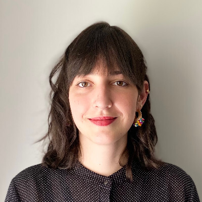

# IBM_Gettingstarted

-  Christian Muszynski - [@Christian Muszynski (IBM)](https://bcx2024.slack.com/archives/D06FQS251U1)
-  Florian Lutz -  [@flux](https://bcx2024.slack.com/archives/D06FELQ8TDJ)
-  Christian Baltzer - [@Lena Kohler (IBM)](https://bcx2024.slack.com/archives/D06GCL1V1E1)
-  Hazem Ben Sassi - [@Hazem](https://bcx2024.slack.com/team/U06HP1K1EH3)
-  Maria Sánchez - [@Maria Sánchez](https://bcx2024.slack.com/team/U06J2FQ0UM8)
-  Michele Dolfi - [@Michele Dolfi (IBM)](https://bcx2024.slack.com/team/U06J6UZ4CQZ)
-  Rene Meyer 
-  Ingo Hinkel - [@Ingo Hinkel](https://bcx2024.slack.com/team/U06JRA1JN9Y)