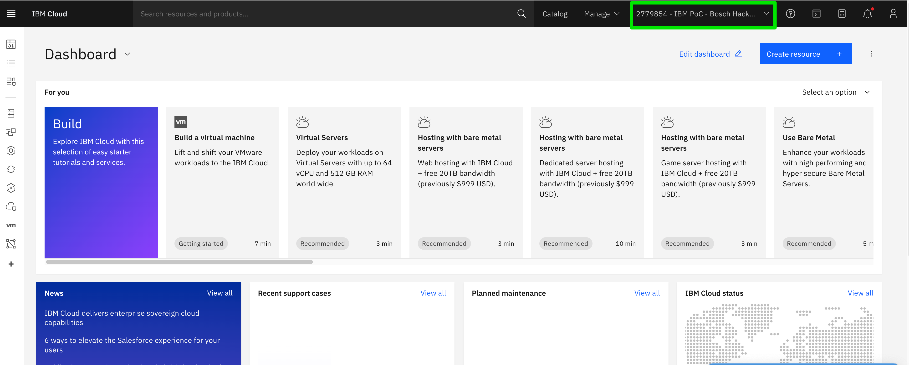
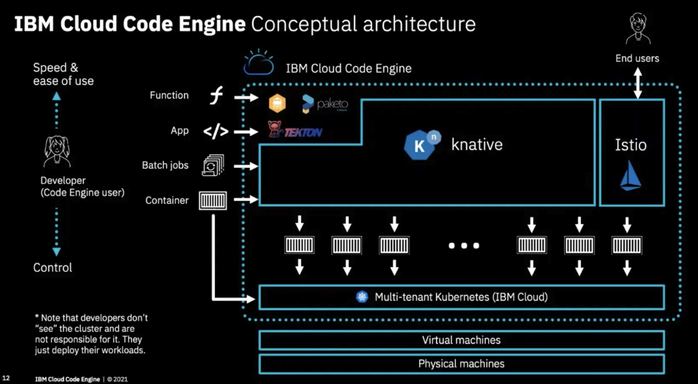

# Access to IBM Cloud
For the Hackathon we prepared an IBM Cloud Account were you could get access to various services like watsonx.ai, databases, object storage, containers or plain IaaS components.
Please contact us in slack:
- @Christian Baltzer
- @René Meyer
- @Florian Lutz

For acecss we need your E-Mail address and a short description what services you need. You will get an invitation afterwards which allows you access to a distinct resource group in the following IBM Account. We will also setup Slack Channels to help you regarding technical questions.

# Quickstarts of selected Services

## Running Containers or serverless Code quickly with IBM Code Engine
We have prepared Code Engine Projects, so that you could run Containers and Servereless Code very quick without having to manage a Kubernetes Cluster:
https://cloud.ibm.com/docs/codeengine?topic=codeengine-getting-started
https://github.com/IBM/CodeEngine?tab=readme-ov-file

## OpenShift/Kubernetes Clusters
If you need OpenShift or Kubernetes Clusters we will set them up for you. 
https://cloud.ibm.com/docs/openshift?topic=openshift-overview
https://cloud.ibm.com/docs/containers?topic=containers-getting-started

## IBM Cloud Object Storage
S3 compatible Object Storage in IBM Cloud
https://cloud.ibm.com/docs/cloud-object-storage?topic=cloud-object-storage-getting-started-cloud-object-storage

## IBM Event Streams (Kafka)
https://cloud.ibm.com/docs/EventStreams?topic=EventStreams-getting-started
https://github.com/ibm-messaging/event-streams-samples

## IBM Cloud Databases
We could provide various SQL and NoSQL Database Services for you Apps like:
- PostgreSQL
- MongoDB
- MySQL
- Cloudant

# IBM Cloud CLI installation
For a lot of services and quicker intercation we recommend to install the IBM Cloud CLI:
https://cloud.ibm.com/docs/cli?topic=cli-install-ibmcloud-cli

# IBM Cloud Shell
If you can't install the IBM Cloud CLI you could use also the IBM Cloud browser based CLI shell.
https://cloud.ibm.com/docs/cloud-shell?topic=cloud-shell-getting-started

