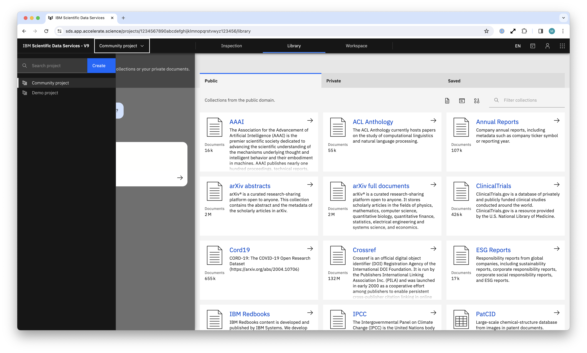
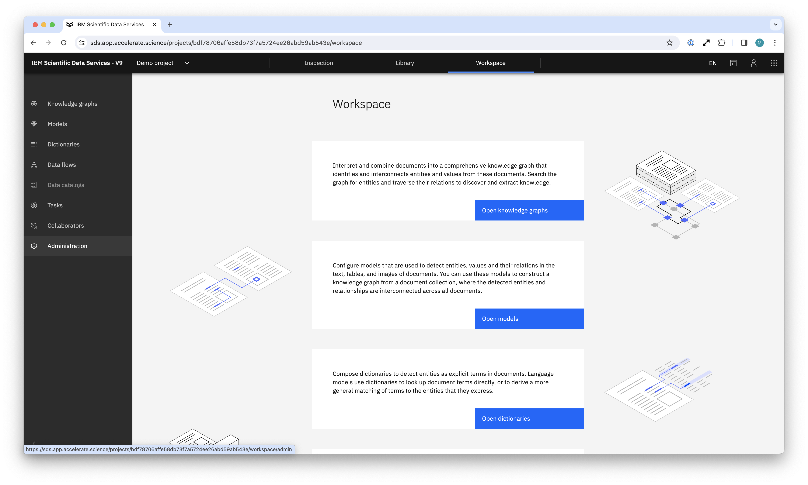
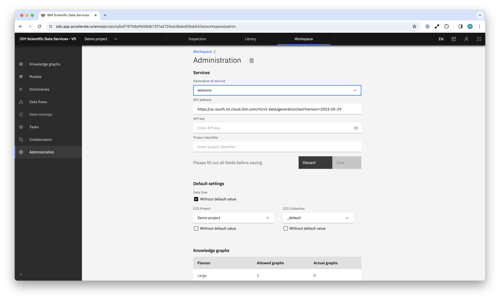

# Connect Deep Search with watsonx.ai

In this guide we provide the steps required for connecting your Deep Search project with watsonx.ai. This will allow you to use Deep Search for retrieval-augmented generation (RAG) use cases.

## Steps

1. Obtain the following information from watsonx.ai
    - `project_id`
    - `apikey`

2. Access the Deep Search project configuration

    1. Choose your project from the dropdown on the left side

        

    2. Navigate to the admin panel: Workspace > Administration

        

3. Set the watsonx.ai values

    

