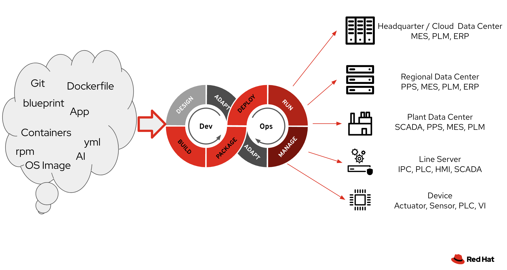

# Manage your Factory devices from OS to application, the GitOps way!

 
Digital.industry: 
## Project overview
### User Story:
As a manager or maintainer of a complex array of infrastructure components in the industrial environment, having a single source of truth for what is in the environment becomes critical.
Using the GitOps approach, create deployment chains for the infrastructure and workload components

### Example Scenarios:
On the factory floor workloads can vary from PLCs to HMIs, a variety of IoT sensors and data collection points, and even computer vision nodes used for visual inspection.
Let's build a platform that can manage and deploy to the device of choice, wheter it be an inferencing node or a controller.

## Getting Started:
Need access to Red Hat software for testing and development? Sign up at https://developers.redhat.com/

## Recommended products and tools
  - Openshift - try the [pre-configured sandbox](https://console.redhat.com/openshift/sandbox) or order one directly on IBM Cloud
  - Using Ansible playbooks, try [Ansible Lightspeed with WatsonX](https://developers.redhat.com/products/ansible/lightspeed)
  - Need an MLOps platform? have a look at [OpenSift AI](https://www.redhat.com/en/technologies/cloud-computing/openshift/openshift-ai)
  - Using Ansible playbooks, try [Ansible Lightspeed with IBM WatsonX Code Assistant](https://developers.redhat.com/products/ansible/lightspeed)

## Demos
  - Pre-configured RHEL environment for [GitOps using Event Driven Ansible and Red Hat Device Edge](https://www.youtube.com/watch?v=XCtfy7AqLLY&t=1525s)
  [This environment](https://github.com/redhat-manufacturing/device-edge-workshops/blob/gitops-demo/exercises/rhde_gitops/demo/README.md) is setup at the venue. Contact the hack coach for access

## More Information:
  - Tunnel connections between services using [Red Hat Service Interconnect (Skupper)](https://access.redhat.com/documentation/en-us/red_hat_service_interconnect/1.4/html/introduction/index)
  - [Secure Device onboarding using FDO](https://access.redhat.com/documentation/en-us/red_hat_enterprise_linux/9/html/composing_installing_and_managing_rhel_for_edge_images/assembly_automatically-provisioning-and-onboarding-rhel-for-edge-devices_composing-installing-managing-rhel-for-edge-images#:~:text=The%20FIDO%20Device%20Onboarding%20(FDO)%20process%20automatically%20provisions%20and%20onboards,should%20run%20on%20secure%20networks)

## Hack Partners / Coaches:
  - Red Hat - Hendrik van Niekerk [@Hendrik van Niekerk](https://bcx2024.slack.com/archives/D06J3RV2EB1) 